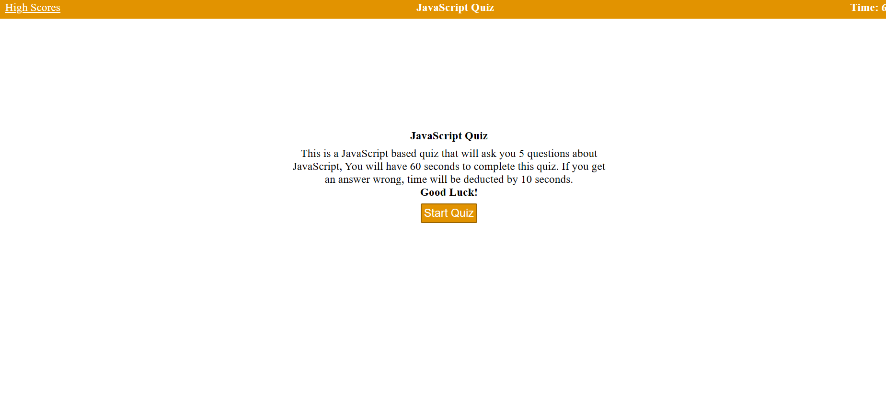
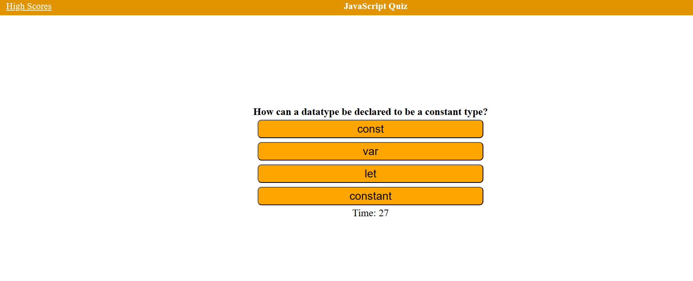
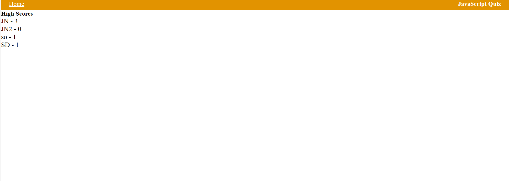

# JavaScript Quiz

## Description
This project is a timed code quiz game. It is designed to test your programming knowledge under time pressure. The game begins when you click the start button, and you are then presented with a programming question. For each question you answer, you are given another one. If you answer incorrectly, time is deducted from your remaining time. The game ends when all questions have been answered or the timer has run out. At that point, you can save your initials and your score.

## Instructions
1. Click the start button to begin the game.
2. You will be presented with a programming related question and multiple choice answers.
3. Click on the answer you believe is correct.
4. If you are correct, you will be presented with another question.
5. If you are incorrect, time will be subtracted from the clock.
6. Continue to answer questions until you have completed all questions or the timer reaches 0.
7. Once the game ends, you will be able to save your initials and your score and it will save it on the local storage as well.

## Features
- Timer countdown
- Multiple choice questions
- Time deduction for incorrect answers
- Scoreboard to save initials and score

## Technologies
* HTML
* CSS
* JavaScript

## Links 
[Github](https://github.com/sunainaojha/JS-JavaScript-Quiz)

[live UrL](https://sunainaojha.github.io/JS-JavaScript-Quiz/)

## Screenshots

